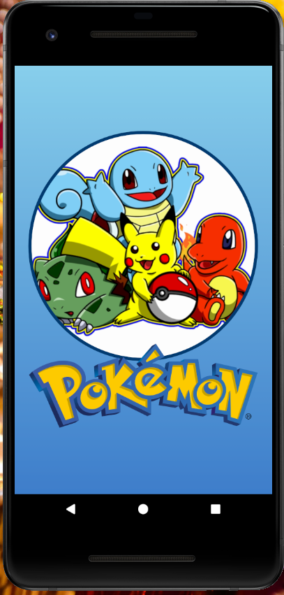
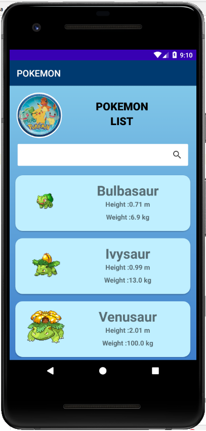
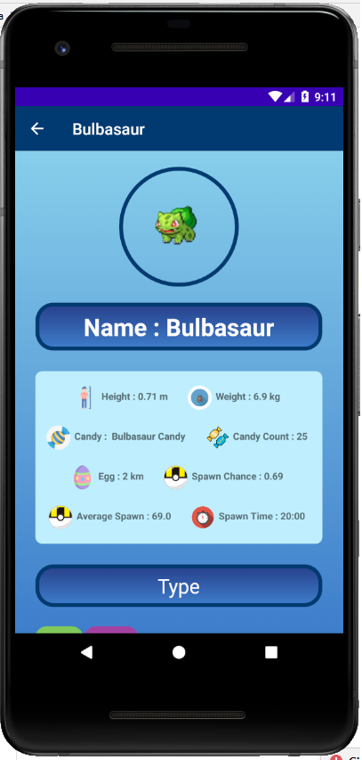
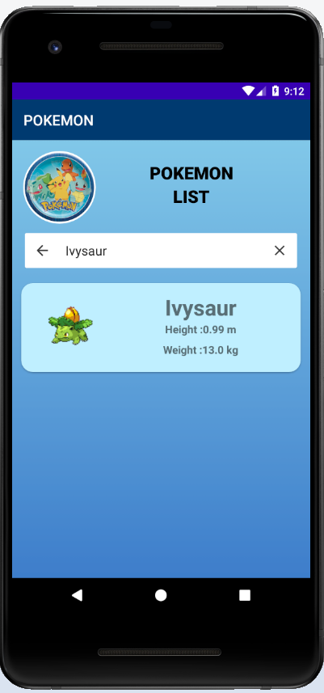

# Pokemon
 
See Pokemon_Application_Documentation file for details

http://www.json-generator.com/api/json/get/cfxSFgvWxu?indent=2
Api used to fetch data of Pokemon.

Resources used for guidenace
a.	https://github.com/AsynctaskCoffee/PokeApi-pokedex
b.	https://raw.githubusercontent.com/Biuni/PokemonGO-Pokedex/master/pokedex.json
c.	https://github.com/alvareztech/Pokedex
d.	https://www.youtube.com/watch?v=r2ALBYx1JuY

Screenshot:

Splash Screen:
  

List of Pokemon
  

Details Screen of Pokemon
  

Search Pokemon Character
  

